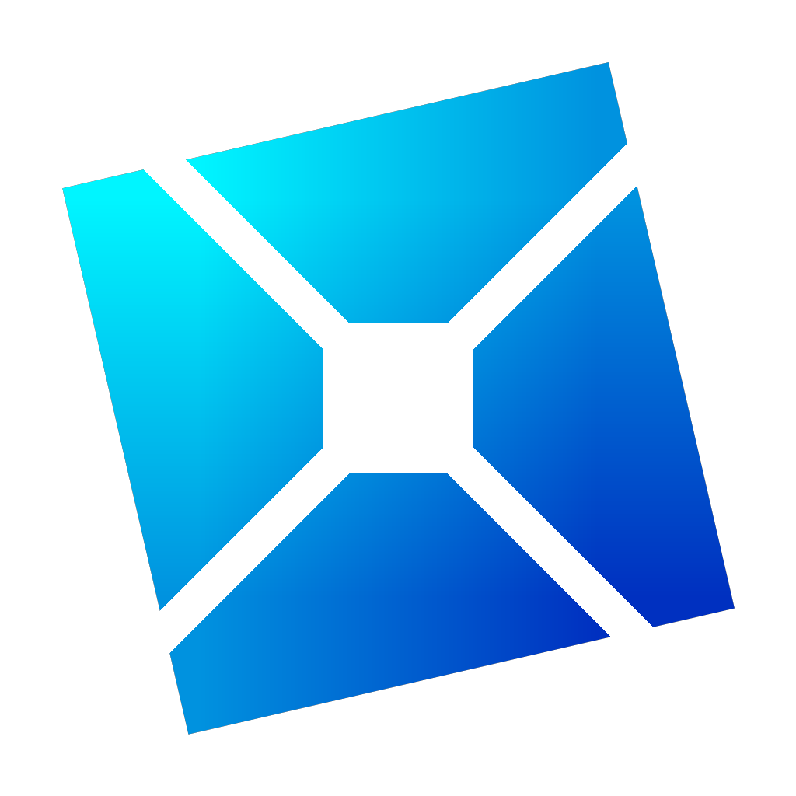

    

<h1 align="center">Goosetrap</h1>

    <strong>A fast, optimized, and customizable launcher for Roblox.</strong>

---

**Goosetrap** is a fork of Bloxstrap / Fishstrap designed specifically to maximize FPS, achieve extreme graphics optimization, and easily manage Roblox engine settings.

---

## 🚀 Key Features

- **Extreme FPS Unlocker** (Frame rate unlocking and custom cap limits).
- **"Potato PC" Mode** (Complete disablement and 1x1 downscaling of textures, disabled shadows, grass, and post-processing effects).
- **Multi-Account Manager** (Quickly save multiple accounts and launch them directly without using a browser, enabling multi-instance/multi-roblox).
- **Active Clients Monitor** (View running Roblox clients, monitor RAM usage in real-time, and easily restart or close accounts).
- **Clean UI & Modern Design** (Sleek dark theme with simple navigation, fully translated into English and Russian).

---

## 📖 FPS Boost & Optimization Guide

To get the **maximum FPS** and remove stuttering in Roblox, follow these steps:

### 1. Unlocking FPS (FPS Cap)
1. Open **Goosetrap Settings**.
2. Navigate to the **"Engine Settings"** tab.
3. Scroll down to the **"Goosetrap Optimization"** section.
4. Set the **"FPS Cap"** value to `0` or `9999` to remove the default Roblox 60 FPS lock.

### 2. "Potato PC" Mode (Removing Textures and Graphics)
If you have a low-end computer or need maximum performance in demanding games (like simulators, shooters, etc.):
1. In the **"Goosetrap Optimization"** section, enable the **"Remove Textures and Graphics (Potato PC)"** toggle.
2. **What this does:**
   - Compresses all game textures down to 1x1 pixels (rendering them as solid plastic blocks, which massively reduces video memory and GPU load).
   - Completely disables grass rendering.
   - Completely disables shadows.
   - Turns off Anti-Aliasing (MSAA) and post-processing effects (blur, bloom, color correction).

### 3. Additional Settings for Performance
In the same **"Engine Settings"** tab, we recommend setting:
- **Anti-Aliasing (MSAA):** Set to `Disabled` (Potato PC mode turns this off automatically).
- **Rendering Mode:** Choose `Direct3D 11` (most stable API for Windows) or `Vulkan` (recommended for AMD graphics cards).
- **Texture Quality:** If Potato PC mode is disabled, select `Level 1 (Lowest)` for optimized texture resolution.

---

## 📦 Download & Installation

1. Go to the [Releases](https://github.com/happy-g0ose/Goosetrap/releases) section of our repository.
2. Download the latest **`Goosetrap.exe`** executable.
3. Run the installer to configure your preferences and set up your Goosetrap app directory.
4. To open the settings menu later, launch Goosetrap with the `-menu` argument or open it from the Start Menu.

---

*Goosetrap is an open-source, non-profit community project. Roblox is a registered trademark of Roblox Corporation.*
